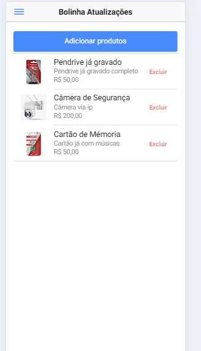

# 📚 Student CRUD App


## 🚀 Sobre o Projeto

Este projeto é um aplicativo de CRUD de comércio com **Ionic 3** e **Node.js 10.24.1**. Ele permite adicionar, editar, listar e excluir produtos de uma base de dados. 



## 🛠️ Tecnologias Utilizadas

- **Ionic 3**: Framework para desenvolvimento de aplicações híbridas.
- **Node.js 10.24.1**: Plataforma para execução do JavaScript no backend.

## 📋 Funcionalidades

- 📄 **Listar produtos**: Veja a lista completa de produtos cadastrados.
- ➕ **Adicionar produtos**: Cadastre novos produtos no sistema.
- ✏️ **Editar produtos**: Atualize as informações de um produto existente.
- ❌ **Excluir produtos**: Remova produtos do sistema.

## 🖥️ Como Executar o Projeto

- 🖥️ Video no youtube explicando informações: https://youtu.be/72T6s_gHRJM

### Pré-requisitos

- [Node.js 10.24.1](https://nodejs.org/en/download/)
- [Ionic 3](https://ionicframework.com/docs/v3)

### Instalação

1. Clone o repositório:

    ```bash
    git clone git@github.com:gabrieltavaresmelo/ionic-alunos.git
    ```

2. Navegue até o diretório do projeto:

    ```bash
    cd ionic-alunos
    ```

3. Instale as dependências:

    ```bash
    npm install
    ```

### Executando o Aplicativo

1. Inicie o aplicativo Ionic:

    ```bash
    ionic serve
    ```

2. Acesse o aplicativo em seu navegador em [http://localhost:8100](http://localhost:8100).

## 📦 Estrutura do Projeto

```bash
/
├── src/
│   ├── app/              # Configuração principal do aplicativo
│   ├── assets/           # Recursos estáticos (imagens, ícones, etc.)
│   ├── pages/            # Páginas do aplicativo (Home, AddStudent, etc.)
│   ├── providers/        # Serviços de API e outros provedores
│   └── theme/            # Estilos globais do aplicativo
├── server.js             # Arquivo principal do servidor backend
├── package.json          # Dependências e scripts do projeto
└── README.md             # Documentação do projeto
```

## 🤝 Contribuindo

Contribuições são sempre bem-vindas! Sinta-se à vontade para abrir um issue ou enviar um pull request.

## 📄 Licença

Este projeto está sob a licença MIT - veja o arquivo [LICENSE](LICENSE) para mais detalhes.

## 📞 Contato

- **Nome:** Williams Torres Garcia da Silva
- **Email:** wtdesigner23@gmail,com
- **Portifolio:** [Seu Perfil](https://github.com/Williamstorres23)
